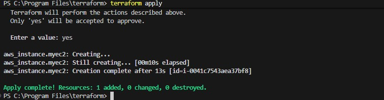
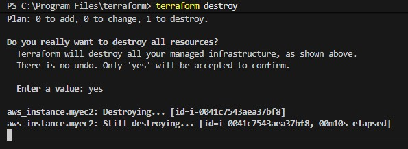
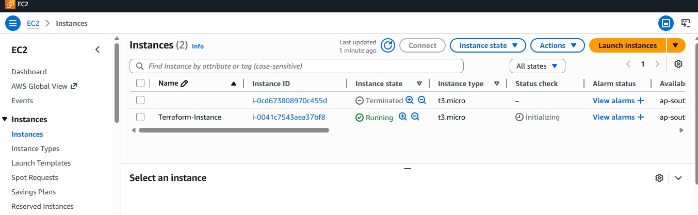

#  Terraform EC2 Instance Management


## 📋 Project Overview

This project demonstrates a basic Terraform workflow for creating and destroying an AWS EC2 instance. Below is a summary of the configuration and the resulting state after running `apply` and `destroy`.

---

## 📁 Files Overview

| File Name | Description | Preview |
|-----------|-------------|---------|
| `main.tf` | Terraform configuration file defining the AWS provider and EC2 instance resource | 📄 |
| `creating.jpg` | Screenshot of the `terraform apply` command output showing successful creation ||
| `auto-remove.jpg` | Screenshot of the `terraform destroy` command output showing successful destruction ||
| `result.jpg` | Screenshot of the AWS EC2 console showing the instance(s) after operations ||

---

📚 Commands Summary
bash
# Initialize Terraform
terraform init

# Preview changes
terraform plan

# Apply configuration
terraform apply

# Destroy infrastructure  
terraform destroy

# Format code
terraform fmt

# Validate configuration
terraform validate

---
## ⚙️ Terraform Configuration (`main.tf`)

```hcl
provider "aws" {
  region = "ap-south-1"
}

resource "aws_instance" "myec2" {
  ami           = "ami-019715e0d74f695be"
  instance_type = "t3.micro"
  tags = {
    name = "Terraform-Instance"
  }
}
---

## ⚠️ Best Practices

🔐 Never commit .tfstate files to version control

📝 Use variables for reusable configurations

🏷️ Always tag resources for better management

💾 Enable state locking for team environments

🔄 Regularly update provider versions
---

## 🏁 Conclusion
This project serves as a foundation for more complex infrastructure-as-code implementations. The workflow demonstrated here—create → verify → destroy—is essential for development, testing, and production environments.

<div align="center">
⭐ Star this repository if you found it useful! ⭐

</div> ```
